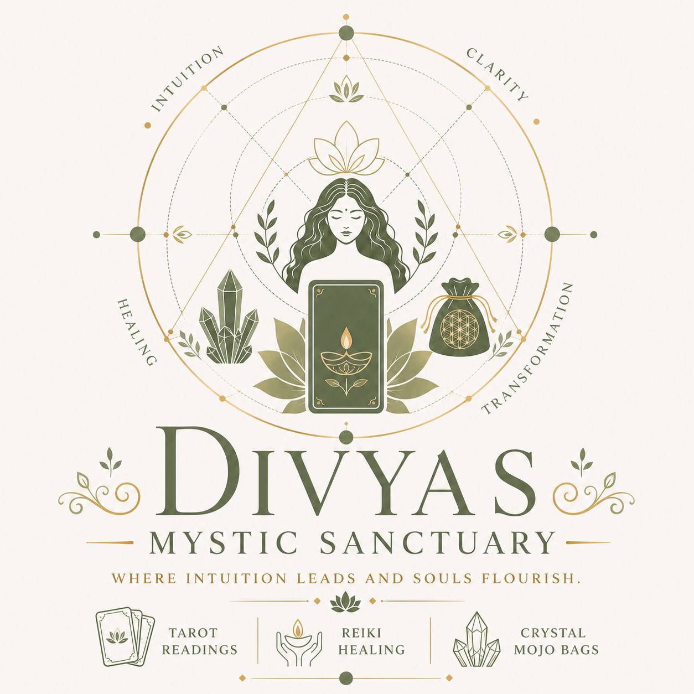

<section class="page-hero reveal">
About Divyas Mystic Sanctuary
<h1>A sanctuary for <em>your inner voice.</em></h1>
A thoughtful, welcoming space for intuitive guidance and gentle renewal.
</section>
<section class="section story-section reveal-on-scroll">
Trust your inner wisdom

The approach
<h2>Guidance with <em>warmth and care.</em></h2>
Divyas Mystic Sanctuary is built on a simple belief: meaningful guidance should leave you feeling more grounded, not more dependent. Every session makes room for your questions, your pace and your own intuition.

Tarot, Reiki and crystal-ball practice are offered as reflective, complementary tools—not as replacements for medical, financial, legal or mental-health advice.

</section>
<section class="section principles">
What you can expect

<article>01<h3>Personal attention</h3>
Sessions begin with what feels most alive for you right now.
</article><article>02<h3>A calm container</h3>
Come as you are. Your experience is treated with discretion and respect.
</article><article>03<h3>Practical reflection</h3>
Leave with thoughtful prompts to carry into your everyday life.
</article>
</section>
<section class="callout reveal-on-scroll">
When to reach out
<h2>When you need a pause, <em>a perspective, or a reset.</em></h2>
Relationships, career decisions, a season of change, a need for rest—there is no “wrong” reason to make space for yourself.
<a class="button button--gold" href="contact.html#book">Book a session ↗</a></section>
